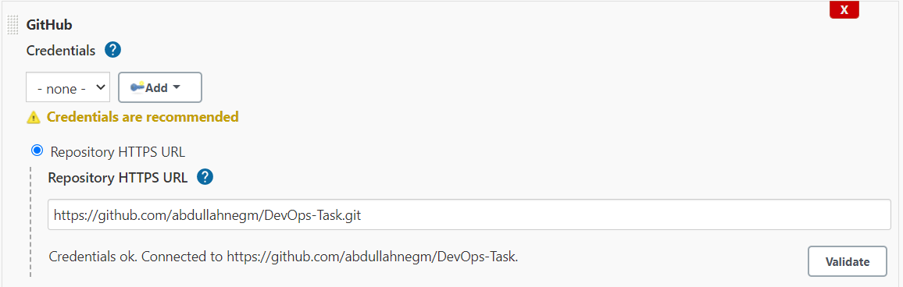

# DevOps-Task

create a Dockerfile for any project you have
create an ec2 instance 
install docker,jenkins,nginx,certbot using ansible playbook
create jenkins job for the project
add Jenkinsfile to build the project, create an image from the Dockerfile , publish it to DockerHub then use ansible to create a container from that image

*Install Nginx, Docker, Jenkins, certvot*

*Multi-branch Jenkins file Configurations*

*Multi-branch pipeline result*

*Docker containers before running ansible playbook*

*ٌRun docker container using ansible*

*Docker containers After running ansible playbook*

*Nginx redirects traffic from port 80 to application port [1234]*

